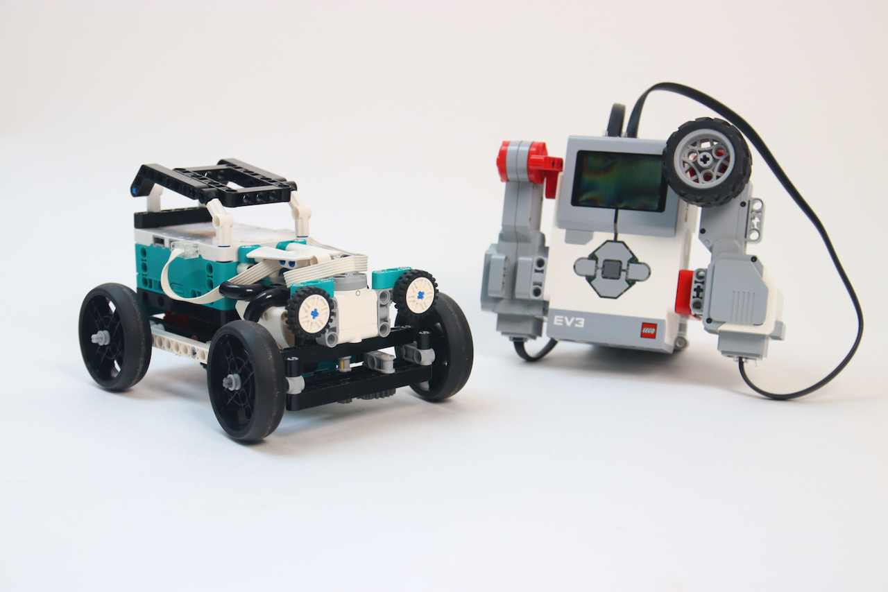

# Remote controlling an EV3 robot with a Robot Inventor hub in Python

## LEGO used in this demo
Just two simple robots: 
- One EV3 brick with motors in ports B and C. The motor in port C has a wheel attached to it to use for steering.
- A hot rod car robot with differential gear. The steering motor is in port F. Propulsion is in port E.

## Installation
1. Run ev3dev.org on your EV3 brick
2. Pair the hub with the EV3 brick through brickman on the EV3 brick. Remember to press the little Bluetooth button on the hub. 
3. Write down the Bluetooth address when done. It looks like this: `A8:E2:C1:9B:A0:61`
4. Adapt the script in main.py with your hub's Bluetooth address.

## Usage
Control the car with the EV3 motors, steering, and throttle.
Press the center button on the EV3 brick to stop

## How it works
The EV3 brick sets motor voltages using a REPL command over Bluetooth RFCOMM. 
