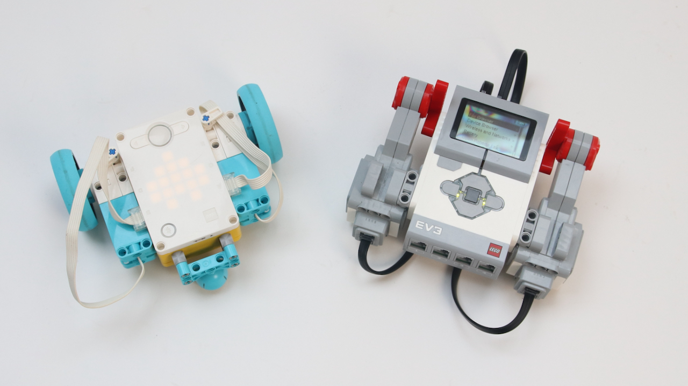
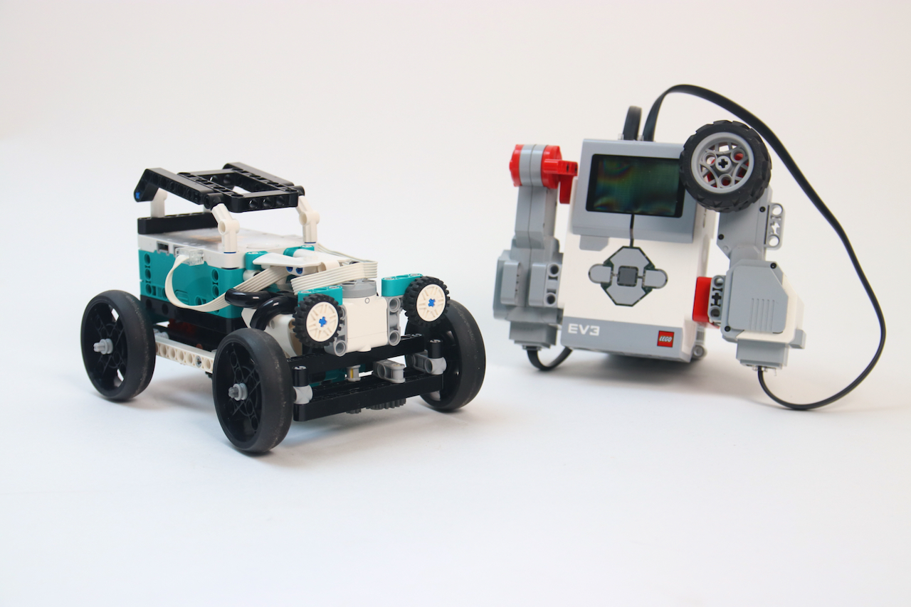

# SPIKE / Robot Inventor Bluetooth RFCOMM #

This library enables the communication between EV3 and the new LEGO SPIKE Prime and Robot Inventor hubs over Bluetooth classic RFCOMM. 




## Installation
### Easy
1. Create a new MINDSTORMS EV3 project in Visual Studio Code, using the MINDSTORMS Extension
2. Copy and paste spikerfcomm.py into it.

### Nice, Pro
1. Fork this project
2. Create a new MINDSTORMS EV3 project in Visual Studio Code, using the MINDSTORMS Extension. Save it inside the projects folder of your fork.
3. Symlink spikerfcomm.py into your project: `ln -s ../../spikerfcomm.py .`
4. Develop and do a pull request with your code and adjustments.


## Usage
### Example projects
- After cloning, open a new VS Code window (cmd-shift-N).
- Open the subfolder of 'Projects' of this repo with just the project you want to run.
- Make sure you paired your SPIKE or Robot Inventor hub with your EV3. 
- Note the Bluetooth MAC address.
- Replace the MAC address in the main.py file with your MAC address.
- Press F5.
- Press a button on the EV3 to neatly clean up the connection when done.

### Your own project
``` python
import spikerfcomm
repl = SpikePrimeREPL('A8:E2:C1:9B:12:C3') # Replace with BT Address of your own hub.
print("According to Robot Inventor, 1+1=", repl.run("print(1+1)"))
```


## Research & todo
- Find a way to set up a connection between two new hubs and also use this library.
- Add more examples
- Expand documentation and explainers
